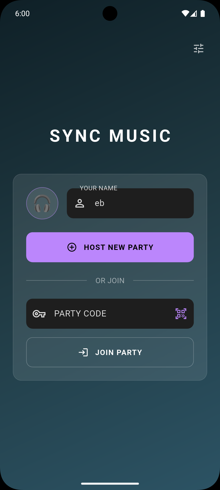
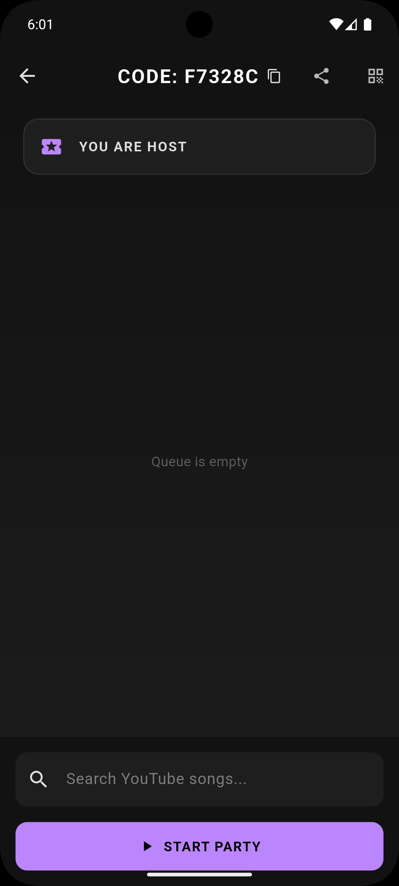
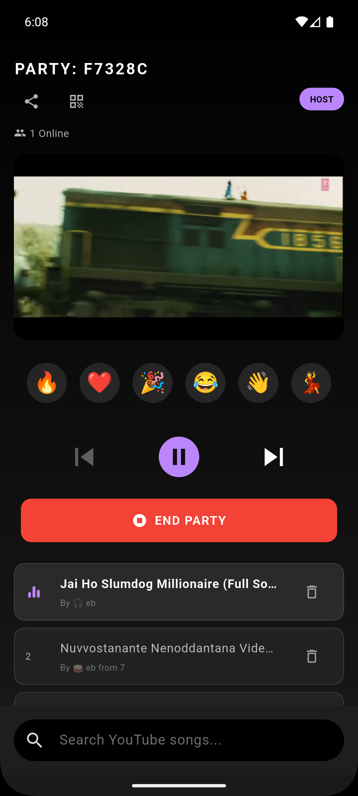

# Sync Music 🎵

A real-time music synchronization app built with Flutter and Node.js (Socket.IO). Host parties, join with friends, and listen to music together perfectly synchronized across multiple devices.

## ✨ Features

### 🎧 Core Features
*   **Real-time Synchronization:** Music plays, pauses, seeks, and skips at the exact same time for everyone.
*   **Host & Guest Roles:**
    *   **Host:** Full control over playback (Play/Pause, Seek, Skip, Remove tracks) and party management (End party).
    *   **Guest:** Suggest songs, vote to skip, and enjoy the show.
*   **YouTube Integration:** Search and add any song from YouTube directly within the app.
*   **Queue Management:** A shared playlist where everyone can contribute.
*   **Smart Joining:**
    *   **QR Code:** Scan a QR code to join instantly.
    *   **Party Code:** Enter a short 6-character code.
    *   **Deep Linking:** Share a link to invite friends directly.

### 🚀 Advanced Features
*   **One-Way Notifications:** Receive alerts for party invites and app updates (FCM).
*   **Live Reactions:** Send floating emojis (🔥, ❤️, 🎉) that animate on everyone's screen in real-time.
*   **User Avatars:** Choose a fun musical emoji avatar to represent yourself in the party.
*   **Vote to Skip:** Guests can vote to skip the current track (requires majority).
*   **Performance Monitoring:** Integrated Firebase Performance Monitoring for optimized experience.
*   **Wakelock:** Keeps the screen on and music playing even when idle.

## 🛠 Tech Stack

*   **Frontend:** Flutter (Dart)
*   **Backend:** Node.js, Express, Socket.IO
*   **Database:** In-memory (transient party state)
*   **Services:**
    *   **Firebase:** Crashlytics, Analytics, Remote Config, Cloud Messaging (FCM).
    *   **Media:** `youtube_player_flutter`, `youtube_explode_dart`.
    *   **Utils:** `wakelock_plus`, `qr_flutter`, `mobile_scanner`, `share_plus`.

## 📱 Screenshots

| Home Screen | Waiting Screen | Party Screen |
|:---:|:---:|:---:|
|  |  |  |

*(Note: Add actual screenshots to a `screenshots` folder in your repo)*

## 🚀 Getting Started

### Prerequisites
*   Flutter SDK (3.10+)
*   Node.js (16+)
*   Firebase Project (for notifications/analytics)

### Installation

1.  **Clone the repository:**
    ```bash
    git clone https://github.com/yourusername/sync_music.git
    cd sync_music
    ```

2.  **Install dependencies:**
    ```bash
    flutter pub get
    cd server && npm install
    ```

3.  **Firebase Setup:**
    *   Create a Firebase project.
    *   Download `google-services.json` and place it in `android/app/`.
    *   Enable **Remote Config**, **Crashlytics**, and **Messaging**.

4.  **Run the Backend:**
    ```bash
    cd server
    node index.js
    ```
    *(Or deploy to Render/Heroku)*

5.  **Run the App:**
    ```bash
    flutter run
    ```

## 🤝 Contributing

Contributions are welcome! Please fork the repository and submit a pull request.

## 📄 License

This project is licensed under the MIT License - see the [LICENSE](LICENSE) file for details.
